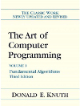

**Conteúdo**
* Do not remove this line (it will not be displayed)
{:toc}

[Plano de aulas - PDF](../assets/AE22CP-172-plano.pdf)

## Motivação para a disciplina
  * Algoritmos e Estruturas de Dados é o primeira conteúdo de substância em programação
  
  * Inicia-se o aprendizado de como abstrair conceitos reais no computador 	

  * Qual motivação para exemplificar?
    - Redes complexas: network science, complex networks

  * Dar alguns exemplos e analisar como eles poderiam ser armazenados na memória

    - Matrizes esparsas: 2m00s (Sistemas complexos em geral, pássaros)
    
    
    - Emergencia: 6m06s (Cardume de peixes, redes de neurônios)
    
    
    - Redes sociais: 1m15s (redes sociais, em geral)
    
    
    - Scale-free: 1m44s (Seis graus de separação)
    
    
    - Consequências dos hubs como influência:
    
      + 3.5 degrees of separation [facebook](https://research.fb.com/three-and-a-half-degrees-of-separation/)
  
	  + Publicidade
	  
      + Google PageRank
      
      + Vacinação, imunização
      
      + Resiliência (rede computadores)

## Escopo e objetivos
  - Estrutras de dados lineares
   
  - Compreender os pontos fortes e fracos de cada estrutura de dados em termos de:
  
    + Eficiência de tempo
    
    + Eficiência de uso de memória
    
    + Trade-off
    
    + Nesse contexto, ser capaz de avaliar:
      
      * Qual estrutura de dados utilizar em determinada situação

	
## Por que não utilizar as estruturas já vistas?
	
  * Quais a dificuldades de utilizar as estruturas já vistas? 
  
    - heterogêneas,
    
	- homogêneas,
	
	- dinâmicas
		
  * Como solucionar isso:
  
    - structs,
    
	- unions,
	
	- alocação dinâmica
	
	- encadeamento,
		
		
  * Por que eu aprender a implementar essas estruturas?
  
    - Entender o funcionamento permite escolher a mais adequada,
    
	- Eficiência no uso de tempo e memória.
	
	
  * Grande diferencial entre programadores "amadores", essa falta de 
	  entendimento, do que acontece. 
	  
# Plano de aulas
  * Resumo do conteúdo [PDF](../assets/AE22CP-172-plano.pdf)
  
    - Relacionar às estruturas de dados em [C++ STL](http://www.cplusplus.com/reference/stl/)
    
    - Utilizar os mesmos nomes de estruturas que em STL
    
      + Facilitará o aprendizado introdutório das estruturas C++ 
	
  * APS e provas (datas)
  
    - Questões de prova deverão ser solucionadas e testadas no [Hackerrannk: AE22CP-17/2](https://www.hackerrank.com/ae22cp-17-2)
    
    - Concluída as implementações, os códigos a serem avaliados deverão ser submetidos no moodle:
      
      + *Algoritmos e Estruturas de Dados*
    
    
    - Somente códigos submetidos no moodle serão avaliados.
    
    - Detector de plágios será utilizado para verificar os códigos submetidos
      
      + Cópias detectadas e não justificadas receberão nota zero.
      
    - Questões de APS
	
## Livros principais

## Download de livros (em inglês)
[http://gen.lib.rus.ec](http://gen.lib.rus.ec)
	
