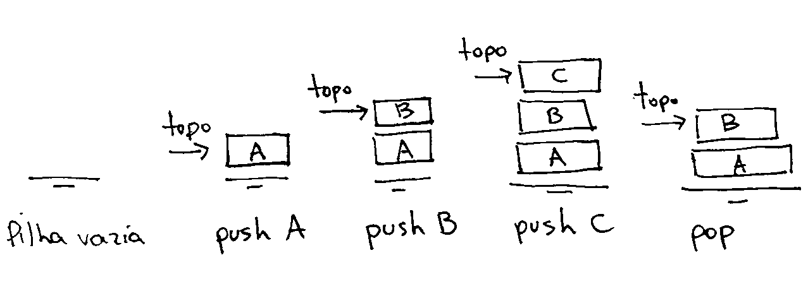

**Conteúdo**
- Do not remove this line (it will not be displayed)
{:toc}

# Políticas de acesso e manipulação

Algumas estruturas de dados não requerem novas formas de armazenamento dos dados em memória. Nesses casos, tais estruturas são definidas apenas pela forma com a qual elas permitem o acesso e manipulação dos dados armazenados, o que chamei de **política de acesso e manipulação**.


Para melhor compreendermos essa ideia, iniciaremos o estudo de duas estruturas de dados (ou políticas de acesso e manipulação) de grande relevância: pilhas (stack) e filas (queue). Por serem apenas políticas de acesso, pilhas e filas podem ser implementadas utilizando como base diferentes tipos de estruturas de dados (contêiners). Neste primeiro momento, no entanto, assumiremos apenas a implementação de pilhas e filas utilizando o contêiner `vector` como base.


## Pilhas (stack)

Pilhas (Stacks) são estruturas de dados com políticas de acesso e manipulação de grande restrição. Há somente uma forma de acessar os elementos de uma pilha.

  - Novos elementos são inseridos em apenas uma direção.
    + O último elemento inserido é chamado o topo da pilha
    + Essa operação é chamada `push`
  
  - Elementos são removidos em direção oposta à inserção
    + Somente o elemento no topo pode ser removido diretamente.
    + Essa operação é chamada `pop`
    
  - Este tipo de política de acesso ficou conhecido pela sigla:    
    + LIFO, do inglês *last in, first out*. O último elemento inserido é necessáriamente o primeiro a ser removido.



Estruturas do tipo `stack` são de grande utilidade em aspectos fundamentais da ciência da computação. Seja na construção de compiladores e linguagens de programação, por uma perspectiv teórica, ou no gerenciamento de memória da pilha de chamadas ([stack call](https://pt.stackoverflow.com/questions/3797/o-que-s%C3%A3o-e-onde-est%C3%A3o-o-stack-e-heap))

Implementações de pilhas em linguagens de programação:

  - C++/STL, [stack](http://www.cplusplus.com/reference/stack/stack/)
    + http://www.cplusplus.com/reference/stack/stack/
    
  - Python, [Using lists as stacks](https://docs.python.org/2/tutorial/datastructures.html#using-lists-as-stacks)
    + https://docs.python.org/2/tutorial/datastructures.html#using-lists-as-stacks
    
  - C#, [Stack](https://msdn.microsoft.com/pt-br/library/system.collections.stack(v=vs.110).aspx)
    + https://msdn.microsoft.com/pt-br/library/system.collections.stack(v=vs.110).aspxs

# Implementação 

## Pilhas usando *vector*

É fácil notar que todas as funcionalidades necessárias para manipular uma pilha já estão implementadas para `vector`. De fato, precisamos apenas de um subconjunto das funcionalidades disponíveis em `vector`, ou seja, pilhas são mais restritivas.

Vejamos quais funcionalidades de `vector` serão úteis para implementarmos uma estrutura pilha (`stack`).
```cpp
// Alocação desalocação
vector* new_vector(int initial_capacity);
void free_vector(vector* v);
// Inserção e remoção de elementos
Type vector_pop_back(vector* v);
void vector_push_back(vector* v, Type value);
// Observer o topo da pilha, sem remoção
Type* vector_at(container* v, int pos);
```

A partir dessa referência podemos definir funções análogas para manipulação de nossa estrutura `stack`.

```cpp
// Redefinir o nome vector
typedef vector stack;
// Alocação desalocação
stack* new_stack(int initial_capacity) {
    stack* s = new_vector(initial_capacity);
    return s;
}
void free_stack(stack* v){
    free_vector(v);
}
// Inserção e remoção de elementos
Type stack_pop(stack* v) {
    return vector_pop_back(v);
}
void stack_push(stack* v, Type value) {
    vector_push_back(v, value);
}
// Retorna um ponteiro para o topo da pilha
Type* stack_top(stack* v) {
    return vector_at(v, 0);
}
```

## Pilhas usando um *container* abstrato

Em princípio, não há problemas em utilizar as funções de `vector` para implementar as funcionalidades de `stack`. Muito pelo contrário, reuso de funções é um dos objetivos da programação estruturada.

No entanto, como mencionado anteriormente, pilhas podem ser implementadas sobre diferentes *contêiners*. A nossa versão atual, porém, está totalmente acoplada ao *contêiner* `vector`.


Como podemos eliminar essa limitação e tornar nossa implementação mais geral ainda? De modo que outros contêiners sequenciais (`list`, por exemplo) também pudessem ser facilmente utilizados quando necessário. A ideia é introduzir uma interface entre a implementação de um contêiner e sua definição.


Essa interface nada mais é do que um arquivo que define todas as funcionalidades que as implementações devem ter para serem um **contêiner**. Tais arquivos, em geral, contém apenas cabeçalhos de funções e possivelmente definições de tipos de dados.

```cpp
// **** container.h ****
#define Type int
typedef struct _container container;
// Funções de remoção de elementos
Type pop_back(container* v);
Type pop_front(container* v);
Type erase(container* v, int i);
// Funções de inserção de elementos
void insert(container* v, Type value, int i);
void push_back(container* v, Type value);
void push_front(container* v, Type value);
Type* at(container* v, int pos);
void set(container* v, int pos, Type value);
void resize(container* v);
void print(container* v, const char* format);
```

Dada uma interface que define um contêiner genérico (abstrato), podemos redefinir nossa estrutura `stack` para que ela utilize essas funções, ao invés daquelas específicas de `vector`.

```cpp
// **** stack.c ****
#include "container.h"
// Redefinir o nome vector
typedef container stack;
// Alocação desalocação
stack* new_stack(int initial_capacity) {
    container* s = new_container(initial_capacity);
    return s;
}
void free_stack(stack* v){
    free_container(v);
}
// Inserção e remoção de elementos
Type stack_pop(stack* v) {
    return pop_back(v);
}
void stack_push(stack* v, Type value) {
    push_back(v, value);
}
// Retorna um ponteiro para o topo da pilha
Type* stack_top(stack* v) {
    return at(v, 0);
}
```

## Implementação da interface *container.h*

Até este momento a implementação de `stack` não existe de forma concreta, pois ela depende da implementação de funções que não foram implementadas em `container.h`. 

Como já mencionado anteriormente, podem existir diferentes implementações da mesma interface. Qual delas será utilizada por `stack.c` é uma decisão feita durante a compilação.

Suponhamos a existência de duas implementações de `container.h`, a primeira em `vector.c` e a segunda em `list.c`. Ao passarmos uma das duas ao compilador, elas fornecerão a implementação das funções abstratas utilizadas em `stack.c`.

```
gcc main.c stack.c vector.c -o main-vector

gcc main.c stack.c list.c -o main-list
```
